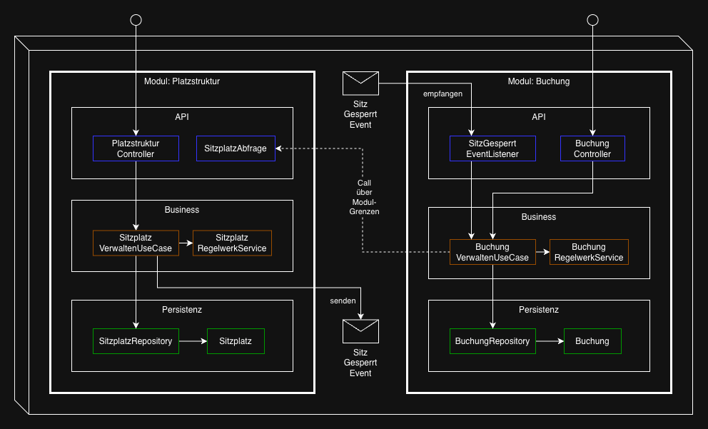

# Spring DDD Example

Demo-Projekt für Domain-Driven Design mit Spring Boot am Beispiel einer **Sitzplatzbuchung**.

## Anforderungen

Fachliche und technische Anforderungen siehe Dokumente in `/specs`:

## Architektur

Modularer Monolith mit interner 3-Schicht-Architektur (pragmatisch, bewusst kein Clean/Onion-Arc).  
Möglichst viele Klassen auf private bzw package-private Sichtbarkeit, um Kapselung zu erzwingen.  
Prüfung der Modulgrenzen durch Spring Modulith Tests

```
across/             ← modulübergreifende Elemente (Shared Kernel)

buchung/            ← fachliches Modul (Bounded Context)
  api/
  business/
  persistenz/

platzstruktur/      ← fachliches Modul (Bounded Context)
  api/
  business/
  persistenz/
```



## Umgesetzte DDD-Konzepte

### Ubiquitous Language

| Konzept | Umsetzung |
|---|---|
| **Fachsprache im Code** | Klassen, Methoden und Variablen auf Deutsch — Fachbegriffe 1:1 aus der Domäne (`Sitzplatz`, `BereichTyp`) |
| **Rich Domain Model** | Fachliche Methoden statt Getter/Setter (`sperren()`, `stornieren()`, `pruefeIstBuchbar()`) |
| **Stereotype-Annotation** | `@UseCase` als eigene Annotation — macht Fachkonzept im Code sichtbar |

### Strategisches Design

| Konzept | Umsetzung                                                                                                     |
|---|---------------------------------------------------------------------------------------------------------------|
| **Bounded Context** | `platzstruktur` und `buchung` als separate fachliche Module                                                   |
| **Shared Kernel** | `across`-Modul enthält geteilte Konzepte (`DomainException`, `@UseCase`) — bewusst minimaler gemeinsamer Kern |

### Taktisches Design

| Konzept | Umsetzung |
|---|---|
| **Aggregate Root** | `Sitzplatz` und `Buchung` Entity nur über eigenes Repository zugreifbar |
| **Aggregat-Referenz per ID** | `BuchungSitzplatz` referenziert `Sitzplatz` nur über `UUID` — keine direkte Objektreferenz über Aggregat-Grenzen |
| **Value Object** | `SitzplatzNummer` — eingebettet in `Sitzplatz`, ohne eigene Identität |
| **Repository** | `SitzplatzRepository`, `BuchungRepository` — Datenzugriff hinter Aggregat-Grenzen |
| **Domain Service** | `SitzplatzRegelwerkService`, `BuchungRegelwerkService` — fachliche Regeln ohne eigenen Zustand |
| **Domain Event** | `SitzGesperrtEvent` — published von `platzstruktur`, konsumiert von `buchung` |
| **Use Case** | `SitzplatzVerwaltenUseCase`, `BuchungVerwaltenUseCase` — zentrale Geschäftsprozesse |

### Weitere mögliche Ausbaustufen
- darauf wurde in diesem Beispiel bewusst verzichtet
- Entity-ID
  - ein Objekt statt eine UUID um Typensicherheit zu erhöhen
  - z.B. `private final SitzplatzId id` statt `private final UUID id`
- JMolecule
  - JMolecule (Annotationen und Interfaces), um DDD- und Architektur-Konzepte im Code sichtbar zu machen
  - siehe https://github.com/xmolecules/jmolecules
  - Prüfung von Regeln zwischen JMolecule-annotierten Klassen via Spring-Modulith bzw ArcUnit

## Umgesetzte Spring Modulith Konzepte

| Konzept            | Umsetzung                                                                                         |
|--------------------|---------------------------------------------------------------------------------------------------|
| **Module**         | Die oberste Package-Ebene bildet ein Modul — z.B. `buchung` oder `platzstruktur`                  |
| **Events**         | Kommunikation über Modulgrenzen via Events — z.B. `SitzGesperrtEvent`, außer bei Queries          |
| **Abhängigkeiten** | Öffnung eines Packages innerhalb eines Modul für die Außenwelt — z.B. `platzstruktur/api/exposed` |
| **Exposed-API**    | Ein Modul bietet eine öffentliche Schnittstelle für andere Module an — z.B. `SitzplatzAbfrageApi` |
| **Modul-Tests**    | Nur ein Modul hochfahren, bzw deren Beans in den Kontext laden (plus optional abhängige Module)   |
| **Validierung**    | Überprüfen von Modul-Grenzen via Testfall                                                         |
| **Dokumentation**  | Generierung von Dokumentation via Testfall                                                        |    

### Weitere mögliche Ausbaustufen
- Event-Publication-Registry: Speicherung und Verwaltung von Domain Events
- @Externalized Events: Domain Events direkt an externe Messaging-Systeme routen (Kafka, RabbitMQ, AMQP)
- Runtime-Observability: Monitoring & Tracing einzelner Module

## Technologien

- **Spring Boot 4** · **Spring Modulith**
- **Spring Data JDBC** (Aggregat-Grenzen, kein Lazy Loading, einfacher als JPA)
- **Liquibase** · **H2** · **OpenAPI-First** (openapi-generator)
- **RestTestClient** (neuer Client für Tests)

## Tests

| Testart | Layer | Tools | Beispiel |
|---|---|---|---|
| Unit | Business · API | JUnit · Mockito · `@WebMvcTest` · RestTestClient | `SitzplatzVerwaltenUseCaseTest` · `SitzGesperrtEventListenerTest` · `SitzplatzAbfrageApiTest` · `PlatzstrukturControllerTest` |
| Integration | Persistenz · Business | `@DataJdbcTest` · `@ApplicationModuleTest` · H2 | `SitzplatzRepositoryTest` · `BuchungRepositoryTest` · `SitzplatzVerwaltenUseCaseIntegrationTest` |
| Modul | alle | `@ApplicationModuleTest` · Scenario | `SitzGesperrtEventModulTest` · `ModulstrukturTest` |
| E2E | alle | `@SpringBootTest` · RestTestClient | `PlatzstrukturApiE2ETest` · `BuchungApiE2ETest` |

## Starten

```bash
./mvnw spring-boot:run
```

- Swagger UI: http://localhost:8080/swagger-ui
- H2 Console: http://localhost:8080/h2-console
